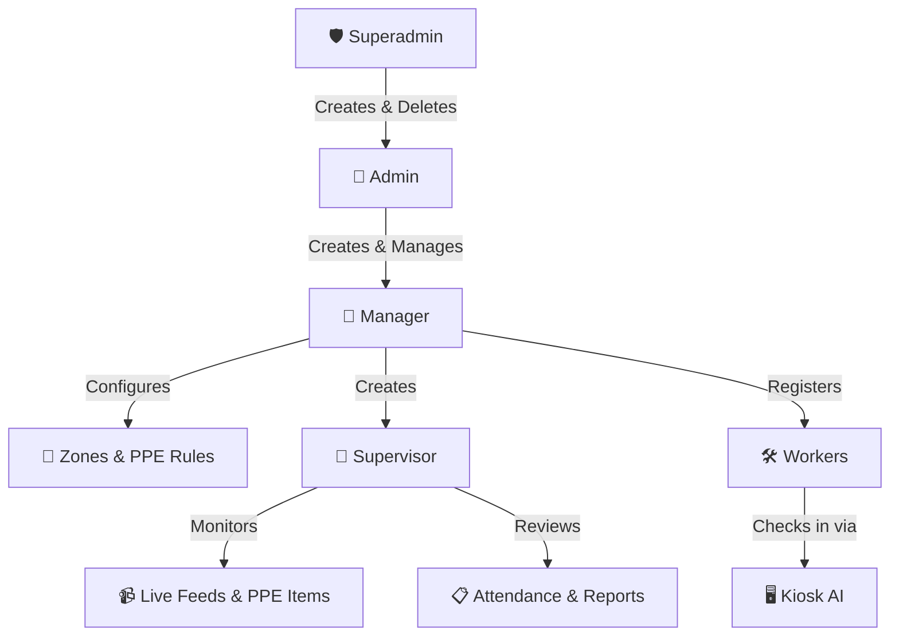

# SafeGuard AI - Project Flow & Architecture

Welcome to **SafeGuard AI**, a comprehensive PPE (Personal Protective Equipment) compliance and construction safety monitoring platform. This document outlines the entire execution flow, role hierarchy, and technical architecture of the system.

---

## 1. System Architecture

SafeGuard AI operates on a modern, decoupled client-server architecture:

- **Frontend (Client)**: Built with **React** (Vite), **TypeScript**, and **TailwindCSS**. It utilizes `zustand` for global state management (handling authentication and user roles) and `react-router-dom` for secure, role-based navigation. Real-time data is handled via WebSocket (`socket.io-client`).
- **Backend (Server)**: Built with **Python / Flask**. It uses **SQLAlchemy** as the ORM, **Flask-JWT-Extended** for secure token-based authentication, and **Flask-SocketIO** to broadcast real-time events (like live camera feeds and violation alerts).
- **Database**: The primary data store is **PostgreSQL** (hosted via Supabase), managing isolated relationships between users, zones, attendance logs, and safety violations.

---

## 2. Role Hierarchy & Access Control

The platform enforces strict Multi-Tenant Role-Based Access Control (RBAC). 



### 1. Superadmin
- **Capabilities**: The absolute top of the chain. Exclusively responsible for creating, reading, updating, and deleting **Admin** accounts across the entire application.

### 2. Admin
- **Capabilities**: Strictly deals with **Managers**. Admins provision Manager accounts and oversee the top-level structural management of their tenant.

### 3. Manager
- **Capabilities**: The primary operational architect. Managers define geographical **Zones** (e.g., "North Wing"), establish strict PPE requirements, register **Workers**, and assign **Supervisors** to oversee specific zones.

### 4. Supervisor
- **Capabilities**: The frontline observer. Supervisors actively monitor their assigned workers, oversee real-time PPE compliance, manage daily attendance logs, and generate reports. They receive real-time alerts from the Kiosk for manual PPE overrides.

### 5. Worker
- **Endpoint**: `/kiosk` (No password required)
- **Capabilities**: Workers interact exclusively with the public-facing Kiosk terminal set up at the entry points of construction zones.

---

## 3. The Execution Flow: A Day in the Life

### Phase 1: Setup (Admin & Manager)
1. The **Admin** logs into their portal and creates a **Manager** account.
2. The **Manager** logs in and configures a **Zone** (e.g., "Scaffolding Area") while assigning required PPE rules.
3. The Manager creates **Supervisors** to monitor those specific Zones, and registers **Workers** into the system (capturing their facial biometric data or badge ID).

### Phase 2: Shift Start (Worker Kiosk)
1. A worker approaches the **Kiosk** iPad/terminal at the entrance.
2. The Kiosk initiates a **Face Scan** (`FaceScanScreen.tsx`), communicating with the backend to verify the worker's identity.
3. The Kiosk prompts the worker to select their destination **Zone**.
4. The system executes a **PPE Verification Check** against the rules defined by the Admin for that specific Zone. 
    - *If compliant:* The worker is granted entry, and an **Attendance Record** is securely logged.
    - *If non-compliant:* The Kiosk blocks entry and sends a real-time WebSocket request to the Zone Supervisor for **Manual Override/Approval**.

### Phase 3: Monitoring & Resolution (Supervisor)
1. The **Supervisor** is logged into their dashboard. They receive an instant WebSocket notification that a worker needs manual PPE approval.
2. The Supervisor views the live camera feed and the worker's captured photo. 
3. If they identify a false positive (e.g., the AI missed the helmet), they click **Approve**, allowing the worker into the site.
4. If a worker violates safety rules *during* the shift, AI cameras generate a **Violation Log**. The Supervisor must review these logs, warn the worker, and click **Resolve** to clear the infraction.

### Phase 4: Reporting & Logs (Supervisor)
1. At the end of the shift or week, the **Supervisor** reviews the comprehensive **Attendance Log**.
2. They monitor the **Safety Leaderboard**, identifying which workers have a 100% compliance rate.
3. They download PDF reports of overall attendance and zone-based compliance metrics for safety auditing.

---

## 4. Running the Project Locally

To boot up the complete architecture on a local machine:

### Backend Initialization
```bash
cd backend
# Activate your virtual environment
.\venv\Scripts\activate
# Start the Flask + Socket.IO server on port 8000
python app.py
```

### Frontend Initialization
```bash
cd frontend
# Install node modules (if not already done)
npm install
# Start the Vite development server on port 5173
npm run dev
```

> [!TIP]
> **API & Socket Ports**
> The frontend automatically maps API requests to `http://localhost:8000`. Ensure the backend remains running to prevent `ERR_CONNECTION_REFUSED` errors in your React components.
